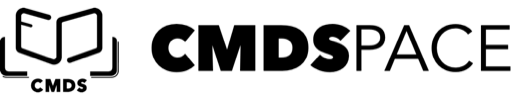
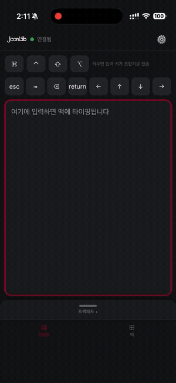
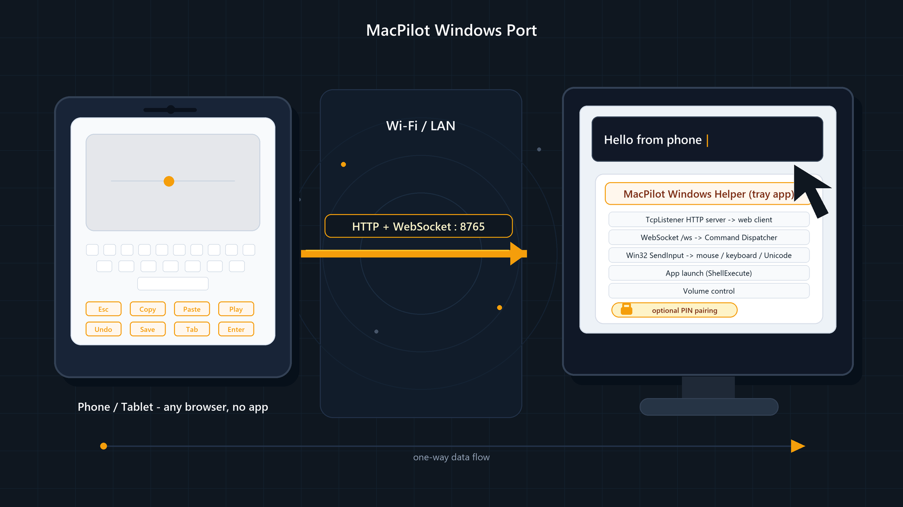

<p align="center">
  <picture>
    <source media="(prefers-color-scheme: dark)" srcset="MacHelper/Web/logo-mark-dark.png">
    
  </picture>
</p>

<h1 align="center">CmdSpace Pilot</h1>

<p align="center">
  <b>Turn your Mac into a wireless trackpad, keyboard & Stream-Deck — controlled from any phone's browser.</b><br>
  <b>No phone app to install. Open source. Forked from MacPilot for CmdSpace.</b>
</p>

<p align="center">
  아이폰·아이패드·안드로이드 어디서든 <b>브라우저만 열면</b> 맥을 마우스/키보드/단축키 패널로 조작. 앱 설치 0.
</p>

<p align="center">
  
  
  
  
</p>

## 🎬 Demo

<p align="center">
  
</p>

<p align="center">
  <a href="https://pub-81d14e6ebfb841109968e9c0ee057d1b.r2.dev/macpilot/macpilot-demo.mp4">▶︎ Open as mp4 file</a>
</p>

---

## What is this?

MacPilot runs a tiny **menu-bar helper on your Mac** that serves a web app over your local Wi-Fi.
Open the URL on **any phone or tablet** and you get a full **trackpad + keyboard + customizable shortcut/macro deck** — all in the browser.

- **No App Store. No install on the phone.** Just open a URL (or scan the QR in the menu bar).
- Works on **iOS, iPadOS, Android** — anything with a browser.
- **Free & open source** — a replacement for paid apps like *Remote Mouse*, *Unified Remote*, etc.

> 원래 비슷한 기능은 유료 앱을 결제해서 써야 했지만, 이건 무료 오픈소스이고 **폰에 앱을 깔 필요조차 없습니다.**

## ✨ Highlights

- 🖱️ **Real-trackpad feel** — cursor with pointer acceleration, tap / double-tap / right-click, tap-and-drag, two-finger scroll **with momentum**, **pinch-zoom**, and **three-finger swipes** (Mission Control / spaces-style)
- ⌨️ **Full keyboard** — types real text incl. **Korean & emoji** (Unicode), plus held-modifier combos (hold ⌘ and type)
- 🎛️ **Stream-Deck-style deck** — folders, swipeable pages, and buttons for:
  - Shortcuts up to **4-key combos** (⌘⌃⇧⌥ + any key)
  - Text snippets · **App / link / deep-link launch** (pick from your installed apps, with icons)
  - **Multi-step macros** (key → delay → text → launch, in sequence)
  - Per-button **icons & colors**, **drag-to-reorder**, move between folders
  - → covers much of what a hardware **Stream Deck** does — on a device you already own, for free
- 🔊 **System controls** — **volume** up / down / mute and **screen brightness**, right from the deck (with the native macOS HUD)
- 🔁 **Deck synced across devices** — the Mac stores it, so iPhone & iPad share the same deck
- 🎨 **Polished UI** — CmdSpace-themed light / dark / system toggle, sensitivity, network presets, and pointer frame-rate controls
- 🛰️ **Always-on local server** — runs via `launchd`; auto-starts at login, auto-restarts. No Xcode needed after setup.
- 🔒 **Local only** — everything stays on your Wi-Fi; nothing goes to the cloud.

## How it works

```
 Phone / Tablet (any browser)                 Your Mac (menu-bar helper)
 ┌───────────────────────┐   Wi-Fi / LAN     ┌──────────────────────────┐
 │  Trackpad · Keyboard  │  HTTP + WebSocket │  NWListener web server    │
 │  Deck (shortcuts/macro)│ ───────────────▶ │  → CGEvent (mouse/keys)   │
 └───────────────────────┘                   │  → open (apps/links)      │
        (just a URL)                          └──────────────────────────┘
```

The web client is **served by the Mac itself** and is plain HTML/CSS/JS with **zero external dependencies**. The Mac side is a small **Swift** menu-bar app that hand-rolls the HTTP+WebSocket server (no frameworks) and injects input via Quartz Event Services (`CGEvent`).

## Requirements

- **macOS 13+** (built & tested on macOS 26, Apple Silicon)
- **Xcode 16+** and **XcodeGen** (`brew install xcodegen`) — to build, once, on the Mac
- A phone/tablet on the **same Wi-Fi** as the Mac

## Install

```bash
git clone https://github.com/joonlab/MacPilot.git
cd MacPilot
brew install xcodegen          # if you don't have it
xcodegen generate
open MacPilot.xcodeproj
```

1. In Xcode → target **MacPilotHelper** → **Signing & Capabilities** → set **Team** to your Apple ID (a free account works).
2. **Run** (▶). A 📡 icon appears in the menu bar.
3. Click the menu-bar icon → **grant Accessibility** (System Settings → Privacy & Security → Accessibility → enable *MacPilot Helper*). Required for input injection — one time, persists.
4. On your phone, open the **`http://<your-mac-name>.local:8766`** shown in the menu (or scan the QR).

### Run it as an always-on server (recommended)

```bash
./deploy.sh
```

Builds a Release app into `~/Applications` and installs a **launchd LaunchAgent** so it starts at login and auto-restarts — **you never need to open Xcode again.** See **[SERVER.md](SERVER.md)** for management commands.

```bash
./script/macpilotctl.sh status
./script/macpilotctl.sh stop
./script/macpilotctl.sh start
./script/macpilotctl.sh restart
./script/macpilotctl.sh sync-web   # 웹(HTML/JS/CSS)만 고쳤을 때 재빌드 없이 즉시 반영
```

### 📱 iPhone: Add to Home Screen (전체화면 앱처럼)

Safari로 접속한 뒤 **공유 → 홈 화면에 추가**. 홈 화면 아이콘(CMDS 로고)으로 열면
주소창 없는 **전체화면 standalone 모드**로 실행됩니다 — 매번 URL 칠 필요 없이 원탭 접속.

### 🌍 원격 접속 (Tailscale)

같은 Wi-Fi가 아니어도 [Tailscale](https://tailscale.com) 테일넷에 묶인 기기끼리는 어디서나 접속됩니다.
서버가 모든 인터페이스에 바인딩되어 있어 **추가 설정 없이** 테일스케일 주소로 열면 끝:

```
http://<mac-name>.<tailnet>.ts.net:8766     # MagicDNS — 영구 고정 주소
```

- 이 주소는 **어느 네트워크에서도 절대 바뀌지 않으므로** 홈 화면 PWA도 이걸로 설치하는 걸 권장 (LAN에서도 WireGuard 직결이라 속도 손해 거의 없음)
- 안드로이드도 Tailscale 앱만 켜면 mDNS 없이 같은 주소로 접속 (IP 바뀜 문제 종결)
- ⚠️ **Tailscale Funnel로 이 포트를 공개하지 말 것** — 서버가 무인증이므로 테일넷 안에서만
- 맥이 깨어 있어야 함: 원격으로 자주 쓰면 시스템 설정 → 배터리 → 전원 어댑터에서 "디스플레이가 꺼져 있을 때 자동으로 잠자지 않게" 켜두기

### 네트워크 자동 최적화

설정(⚙)의 **네트워크/주사율 → 자동**(기본값)은 3초마다 측정되는 RTT에 따라
전송 주사율(36–120Hz)과 움직임 보정을 실시간으로 조절합니다. 빠른/균형/불안정/수동 프리셋도 선택 가능.

## Gesture reference

| Gesture (on phone trackpad) | Action on Mac |
|---|---|
| 1-finger move / tap | Move cursor / left click |
| Double-tap | Double click |
| Tap then drag | Drag (select / move) |
| Two-finger drag | Scroll (with momentum) |
| Two-finger pinch | Zoom (⌘+/−) |
| Three-finger ←→ | ⌘← / ⌘→ |
| Three-finger ↑ / ↓ | Mission Control / App Exposé |
| **Left / Right click buttons** (below the pad) | Click — or **press-and-hold + drag on the pad** for a real drag-select / move |

## Architecture

```
MacHelper/Sources/        Swift menu-bar helper
  HelperServer.swift        NWListener: HTTP + WebSocket, deck sync, app list
  HTTPWebSocketConnection   hand-rolled HTTP + WS framing (no dependencies)
  EventInjector.swift       CGEvent mouse/keyboard/scroll + text + macros
  AppList / DeckStore       installed-app scan, deck persistence
MacHelper/Web/            Web client (served to the phone)
  index.html / style.css / app.js   vanilla, no framework
project.yml               XcodeGen project definition
deploy.sh                 build → ~/Applications → launchd restart
```

## Windows support (experimental)

A separate **Windows helper** (C# / .NET 9) lives under [`WindowsHelper/`](WindowsHelper/) and reuses the
**same web client and WebSocket protocol** — the macOS build is untouched. It runs as a tray app:
a `TcpListener` HTTP+WebSocket server + Win32 `SendInput` injection, **zero runtime NuGet dependencies**.

<p align="center">
  
</p>

- 👉 Build / run / firewall / troubleshooting: **[docs/WINDOWS.md](docs/WINDOWS.md)**
- 👉 Port strategy & design rationale: **[docs/WINDOWS_MIGRATION_PLAN.md](docs/WINDOWS_MIGRATION_PLAN.md)**

```powershell
dotnet build .\WindowsHelper\MacPilot.Windows.sln -c Release
dotnet test  .\WindowsHelper\MacPilot.Windows.sln -c Release
dotnet run --project .\WindowsHelper\src\MacPilot.Windows
```

### Mac / Windows feature parity

| Feature | macOS | Windows |
|---|---|---|
| Trackpad move / drag / click / double-click | ✅ | ✅ |
| Two-finger scroll | ✅ | ✅ (direction tunable) |
| Keyboard shortcuts (⌘→Ctrl mapping) | ✅ | ✅ |
| Unicode text (Korean / emoji) | ✅ | ✅ |
| Macros, app/link launch | ✅ | ✅ |
| Installed-app picker | ✅ (.app) | ⚠️ Start-Menu .lnk (no UWP yet) |
| Volume up / down / mute | ✅ | ✅ |
| Screen brightness | ✅ | ⚠️ laptop panel only (WMI, best-effort) |
| 3-finger gestures / pinch-zoom | ✅ | ⚠️ best-effort key mappings (Win+Tab / Ctrl+Win+←→ / Ctrl±) |
| Always-on server | launchd | tray app (+ optional Startup shortcut, see scripts/) |
| Optional PIN pairing | ✅ (menu toggle, off by default) | ✅ `--pin` (off by default; no client change) |
| Inject into elevated/secure windows | n/a | ❌ blocked by Windows UIPI |

> Windows helper is **LAN/localhost only and unauthenticated by default**, same as macOS. See
> [docs/WINDOWS.md](docs/WINDOWS.md) for the firewall note and security guidance.

## Security

LAN-only and **unauthenticated by default** — anyone on the same Wi-Fi can connect.
On a shared network (e.g. a lecture venue), turn on **PIN pairing** from the menu-bar app: a
phone must enter the shown 6-digit PIN once before it can load the UI or send any input
(the auth is a same-origin cookie, so the web client is unchanged).
Keep it on a trusted network and **do not expose port 8766 to the internet.**
For remote access use Tailscale (see above) — never Funnel.

## Credits & Attribution

CmdSpace Pilot is a branded fork of MacPilot. Original project by **Park Joon (박준) — [JoonLab](https://github.com/joonlab)**.

If you **fork, modify, or redistribute** this project, please keep the credit and **link back to the original repo**:
**https://github.com/joonlab/MacPilot** — the MIT license also requires retaining the copyright & license notice.

> 이 프로젝트를 변형·재배포해서 쓰실 땐 원저작자(JoonLab / 박준)와 위 repo 링크를 표기해 주세요.

## License

[MIT](LICENSE) © 2026 Park Joon (JoonLab)
