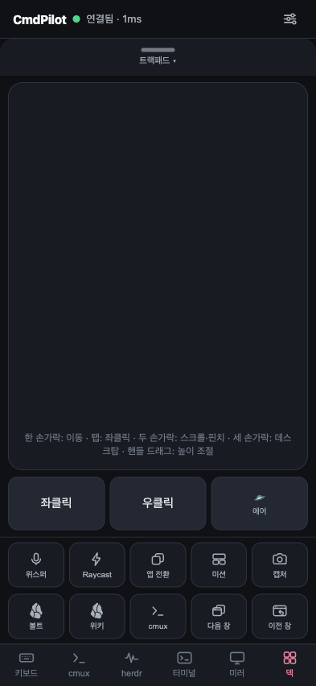
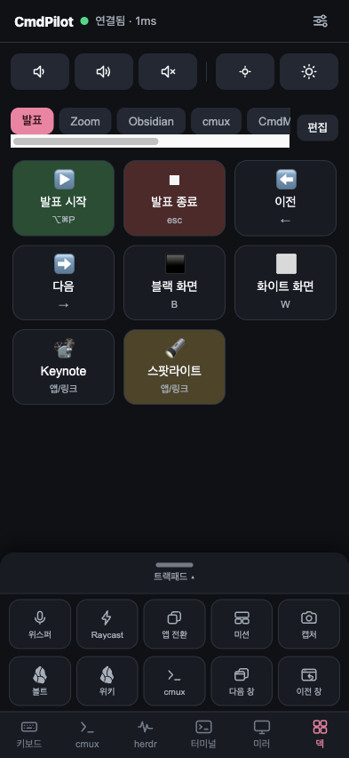
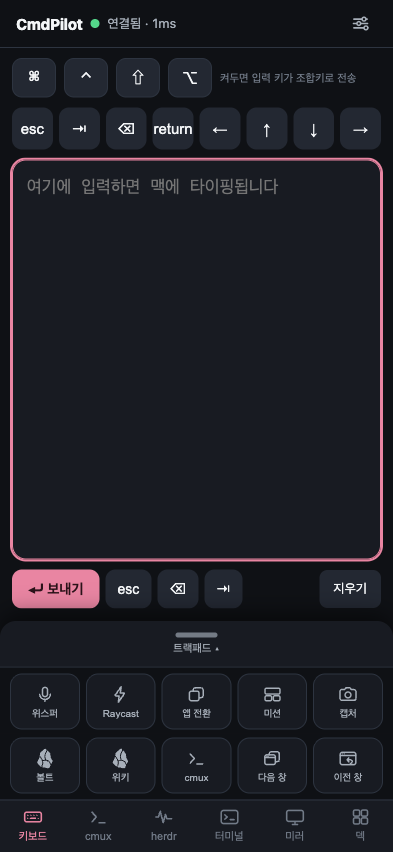
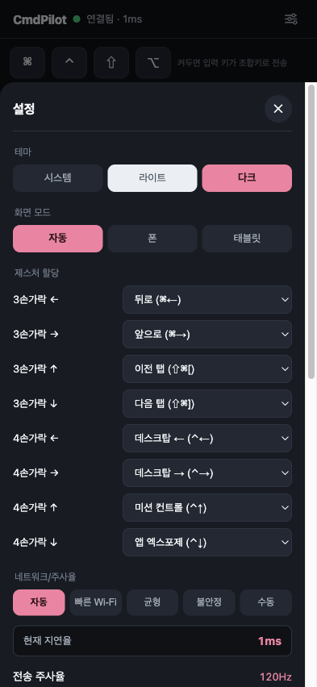

<p align="center">
  
</p>

<h1 align="center">CmdPilot</h1>

<p align="center">
  <b>폰을 맥의 트랙패드 · 키보드 · 스트림덱 · AI 에이전트 리모컨으로.</b><br>
  앱 설치 없이 브라우저만 열면 끝. <a href="https://github.com/joonlab/MacPilot">MacPilot</a>(JoonLab)의 CMDSPACE 브랜디드 포크.
</p>

<p align="center">
  
  
  
  
</p>

<p align="center">
  
  
  
  
</p>

## 무엇인가

맥 메뉴바에 상주하는 작은 헬퍼가 LAN에 웹서버를 띄웁니다. 폰/태블릿에서 URL 하나 열면
**트랙패드 + 키보드 + 커스텀 단축키 덱 + AI 에이전트 리모컨**이 브라우저 안에 통째로 들어옵니다.
폰 앱 없음, 외부 의존성 없음(Swift SDK + 바닐라 JS), 데이터는 내 네트워크 밖으로 안 나감.

## 기능

**⌨️ 코어** (upstream 기반)
- 진짜 트랙패드 감각 — 포인터 가속, 탭/더블탭/우클릭, 드래그, 모멘텀 스크롤, 핀치줌, 3손가락 제스처
- 유니코드 키보드 (한글·이모지), 모디파이어 조합키
- 스트림덱식 **덱**: 단축키(4키 조합)·텍스트·앱/링크/딥링크 실행·멀티스텝 매크로, 아이콘/색/드래그 정렬 — 맥이 저장해서 모든 기기가 같은 덱 공유
- 음량·밝기 (네이티브 HUD)

**🤖 에이전트 원격** (포크 시그니처)
- **에이전트 탭**: ⏎ 승인 / esc 중단 / ⌃C, "계속해줘"·"/compact" 같은 빠른 지시(타이핑+엔터 자동) — 침대에서 Claude Code·Codex 승인 전용 리모컨
- **cmux 통합**: 창·워크스페이스·탭을 이름/색상 칩으로 표시하고 탭 한 번에 전환. 탭 제목으로 에이전트 진행상황 확인 (4초 자동 갱신)

**🖱 반응성**
- TCP_NODELAY + 인터랙티브 QoS (커서 덩어리짐 제거)
- **자동 네트워크 프리셋**: RTT 실측으로 전송 주사율 36–120Hz 자동 조정 + 수동 슬라이더

**📱 접속**
- **홈 화면에 추가(PWA)** → 원탭 전체화면 앱
- 트랙패드 시트 높이 조절(풀/부분/닫힘) — 덱과 레이어로 같이 사용
- **퀵바**(상시 노출): superwhisper ⌥Space · Raycast ⇧Space · 앱 전환 · 미션 컨트롤 · 캡처
- 화면 모드: 자동/폰/태블릿 · 안드로이드 햅틱
- **Tailscale**: 테일넷 기기면 어느 네트워크에서든 접속 (아래 참고)

**🔒 보안**
- LAN/테일넷 전용, 기본 무인증 — 공용 Wi-Fi에서는 메뉴바에서 **PIN 페어링** 켜기 (upstream 기능)

## 설치

```bash
git clone https://github.com/johnfkoo951/CmdPilot.git && cd MacPilot
brew install xcodegen
./deploy.sh        # Release 빌드 → ~/Applications 설치 → LaunchAgent(상시 서버) 자동 구성
```

1. 메뉴바 📡(권한 없으면 ⚠️) 클릭 → **권한 열기** → 손쉬운 사용에서 *CmdPilot Helper* 켜기 (1회)
2. 폰에서 메뉴바에 표시된 주소 열기 (QR 스캔 가능) → **공유 → 홈 화면에 추가**

> Apple ID를 Xcode에 로그인해두면 고정 서명이 되어 재빌드해도 권한이 유지됩니다.
> 없으면 ad-hoc 서명으로 동작하되, 재빌드 때마다 권한을 다시 켜야 합니다 (deploy.sh가 안내).

### 관리

```bash
./script/macpilotctl.sh status|start|stop|restart|logs|open|url
./script/macpilotctl.sh sync-web     # 웹(HTML/JS/CSS)만 고쳤을 때 — 재빌드 없이 즉시 반영
./deploy.sh                          # Swift 수정 시 재빌드·재배포
```

서버는 launchd LaunchAgent로 **로그인 시 자동 시작, 죽으면 자동 재시작**됩니다 (터미널 무관). 상세: [SERVER.md](SERVER.md)

### 원격 접속 (Tailscale)

같은 Wi-Fi가 아니어도 [Tailscale](https://tailscale.com) 테일넷에 묶인 기기끼리는 어디서나:

```
http://<mac-name>.<tailnet>.ts.net:8766     # MagicDNS — 어느 네트워크에서도 불변
```

- 이 주소로 PWA를 설치하면 집/밖 구분 없이 하나의 아이콘으로 사용 (LAN에서도 WireGuard 직결이라 손해 거의 없음)
- 안드로이드도 이 주소로 mDNS 없이 접속 (IP 바뀜 문제 종결)
- ⚠️ **Funnel로 포트를 공개하지 말 것** — 테일넷 안에서만

## 제스처

| 제스처 | 동작 |
|---|---|
| 1손가락 이동 / 탭 | 커서 이동 / 좌클릭 |
| 탭 후 드래그 | 드래그 (선택/이동) |
| 2손가락 드래그 / 핀치 | 스크롤(모멘텀) / 줌 |
| 3손가락 ←→ / ↑↓ | ⌘← ⌘→ / 미션 컨트롤·앱 엑스포제 |
| 핸들 드래그 | 트랙패드 높이 조절 (풀·45%·70%·닫힘) |

## 구조 (요약)

```
MacHelper/Sources/   Swift 메뉴바 헬퍼 — NWListener(HTTP+WS, TCP_NODELAY), CGEvent 주입,
                     덱 저장, PIN 페어링, cmux RPC 브리지, SwiftUI 메뉴(QR·상태·제어)
MacHelper/Web/       바닐라 HTML/JS/CSS 클라이언트 (프레임워크·빌드 없음) + PWA manifest
script/              macpilotctl.sh (launchd 제어 + sync-web)
```

Windows용 헬퍼(커뮤니티 포트)는 [docs/WINDOWS.md](docs/WINDOWS.md) 참고.

## 변경 이력

기능 로그는 **[CHANGELOG.md](CHANGELOG.md)** 참고. upstream에도 개선을 PR로 환원하고 있습니다:
[joonlab#2](https://github.com/joonlab/MacPilot/pull/2) · [joonlab#3](https://github.com/joonlab/MacPilot/pull/3) · [joonlab#4](https://github.com/joonlab/MacPilot/pull/4)

## Credits

원작 **[MacPilot](https://github.com/joonlab/MacPilot)** — **Park Joon (박준) · [JoonLab](https://github.com/joonlab)**, built end-to-end with Claude Code.
CmdPilot 포크 — **구요한 · [CMDSPACE](https://cmdspace.work)**. 포크/재배포 시 원작자와 원본 레포 링크를 유지해 주세요.

## License

[MIT](LICENSE) © 2026 Park Joon (JoonLab) · fork additions © 2026 Yohan Koo (CMDSPACE)
